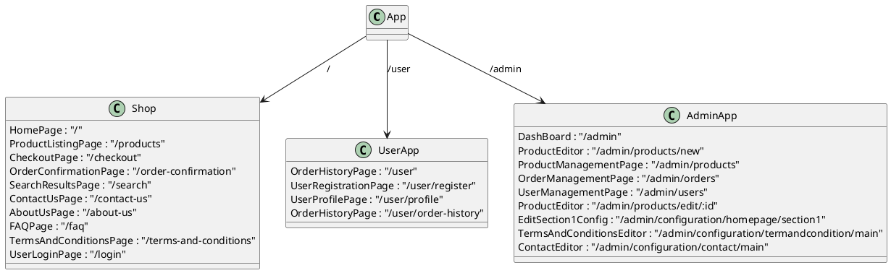
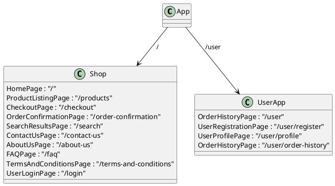

This is my personal project I start to work on 6 months ago. It aim to be a full-stact ecommercial system.

- Backend: Go-gin, Postgres
- Front end: Vite(react). 

You can still view the front end in https://ecummercial.pages.dev. The backend will not deploy anymore

This project almost done, but I decide to stop, because I want to switch the front end to react native.

Thank for the support of modern AI code generated tools. They really help to saved me some time for boring part.


- Old plant uml file






```

```


